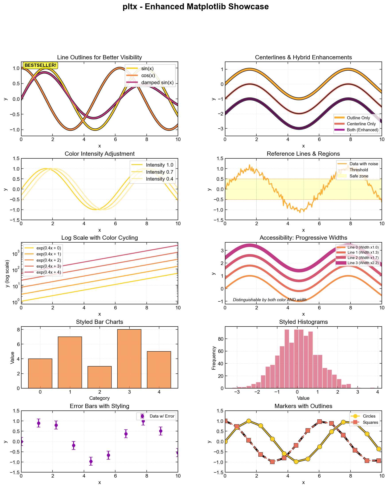

# pltx - Enhanced Matplotlib for Scientific Visualization

**A matplotlib wrapper with publication-quality styling and colorblind accessibility features.**


[](https://www.python.org/downloads/)
<!-- [](LICENSE) -->

---

I got bored to always create some custom formatting for my plots, run into reviewers asking for improving readability.
I want just to import and use it with minor modifications. Here I made something one can install and have pretty looking plots ready to go (just some personal styling on top of matplotlib).

## Key Features

- **Colorblind Accessible** - Progressive line width variation distinguishes lines by thickness AND color
- **Journal-Ready Presets** - Nature, presentation, and poster styles in one function call
- **Line Visibility** - Optional outlines and centerlines for better contrast
- **Drop-in Replacement** - Works with all matplotlib plot types
- **Auto Color Cycling** - Intelligent palette management with intensity control

## Example Gallery




## Quick Start

```python
import pltx.pyplot as plt
import numpy as np

# Enable colorblind-friendly progressive widths
plt.initialize_style(
    palette_name='viridis',
    vary_linewidth=True,              # Lines get progressively thicker
    linewidth_progression_factor=1.3  # 30% increase per line
)

# Plot with automatic styling
x = np.linspace(0, 10, 100)
for i in range(5):
    plt.plot_styled(x, np.sin(x + i*0.5),
                   color_idx=i,
                   centerline=True,  # Add thin line on top
                   label=f'Line {i+1}')

plt.setup_axis(xlabel='x', ylabel='y', grid=True)
plt.legend()
plt.savefig('plot.pdf', dpi=300)
```

## Installation

```python
# Option 1: Direct import
import sys
sys.path.insert(0, '/path/to/pltx')
import pltx.pyplot as plt

# Option 2: Install as package
cd /path/to/pltx
pip install -e .
```

## Key Features in Detail

### 1. Progressive Line Width (Colorblind Accessible)

Each line automatically gets thicker - distinguishable by both color and width:

```python
plt.initialize_style(
    vary_linewidth=True,
    base_linewidth=2.0,
    linewidth_progression_factor=1.3  # 1.2=gentle, 1.3=moderate, 1.5=strong
)
```

**Result:** Line 0: 2.0pt -> Line 1: 2.6pt -> Line 2: 3.4pt -> Line 3: 4.4pt

### 2. Line Enhancements

```python
# Outline (thick line behind)
plt.plot_styled(x, y, color_idx=0, outline=True)

# Centerline (thin line on top)
plt.plot_styled(x, y, color_idx=0, centerline=True)

# Both (maximum contrast)
plt.plot_styled(x, y, color_idx=0, outline=True, centerline=True)
```

### 3. Journal Presets

```python
from pltx.rcparams import apply_style_preset

apply_style_preset('nature')        # Nature journal (Arial, 7-9pt, 3.5")
apply_style_preset('presentation')  # Slides (16-18pt, thick lines)
apply_style_preset('poster')        # Posters (24-28pt)
```

### 4. Works with All Plot Types

```python
from pltx.colors import get_color

# Bar plots
colors = [get_color(i) for i in range(5)]
plt.bar(categories, values, color=colors)

# Scatter plots
plt.plot_styled(x, y, marker='o', linestyle='', color_idx=0)

# All matplotlib functions available!
```

## Real-World Example

### Nature Journal Submission

```python
from pltx.rcparams import apply_style_preset
import pltx.pyplot as plt

# Apply Nature style + accessibility
apply_style_preset('nature')
plt.initialize_style(
    vary_linewidth=True,
    base_linewidth=1.0,
    linewidth_progression_factor=1.3
)

# Single column figure
fig, ax = plt.subplots(figsize=(3.5, 2.6))

for i in range(4):
    plt.plot_styled(x, data[i],
                   color_idx=i,
                   centerline=True,  # Better in print
                   label=labels[i])

plt.setup_axis(xlabel='Time (s)', ylabel='Amplitude (a.u.)')
plt.legend()
plt.savefig('figure1.pdf', dpi=300)
```

## Documentation

- **[FULL_DOCUMENTATION.md](FULL_DOCUMENTATION.md)** - Complete API reference and detailed guide
- **[examples/](examples/)** - Working examples (demo.py, showcase.py, simple_example.py)
- 12 test PDFs demonstrating all features

## Quick Reference

| Feature | Command |
|---------|---------|
| Progressive width | `vary_linewidth=True` |
| Outline | `outline=True` |
| Centerline | `centerline=True` |
| Nature style | `apply_style_preset('nature')` |
| Color cycling | `color_idx=i` |
| Axis setup | `setup_axis(xlabel=..., ylabel=...)` |

## Feature Comparison

| Feature | matplotlib | pltx |
|---------|-----------|------|
| Colorblind accessible | Manual | `vary_linewidth=True` |
| Line visibility | Complex code | `outline=True` |
| Journal styles | Research guidelines | One function call |
| Color palettes | Manual setup | Automatic |

## Progressive Width Factors

| Factor | Increase | Best For |
|--------|----------|----------|
| 1.2 | 20% | 8-10 lines |
| 1.3 | 30% | 4-6 lines (DEFAULT) |
| 1.5 | 50% | 2-4 lines |

## Style Presets

| Preset | Fonts | Figure Size | Use Case |
|--------|-------|-------------|----------|
| nature | 7-9pt | 3.5"x2.6" | Nature journal |
| presentation | 16-18pt | 10"x6" | Slides |
| poster | 24-28pt | 12"x8" | Posters |
| default | 12-13pt | 6"x4" | General |

## Dependencies

**Required:**
- matplotlib >= 3.5.0
- numpy >= 1.20.0

**Optional:**
- seaborn >= 0.11.0 (for extended palettes; falls back to matplotlib colormaps)

## Why pltx?

- **Accessible** - Works for colorblind viewers (~8% of males)
- **Publication-Ready** - Journal-specific presets
- **Easy to Use** - Drop-in replacement for matplotlib
- **Flexible** - Works with all plot types
- **Well-Documented** - Comprehensive guides and examples

## Quick Tips

1. **Always use** `vary_linewidth=True` for multi-line plots
2. **Choose factor** based on number of lines (1.2 for many, 1.5 for few)
3. **Test in grayscale** to verify accessibility
4. **Use presets** to match your target medium
5. **Combine features** for maximum effect

## Testing

The package includes a comprehensive test suite using `pytest`.

```bash
# Install test dependencies
pip install pytest

# Run all tests
pytest tests
```

The test suite covers color palette logic, style initialization, enhanced plotting functions, and style context management.


---

**Version:** 0.1.0
**Python:** 3.10+
**Created:** 2026-01-09
**Author:** Igor Sokolov

For complete documentation, see [FULL_DOCUMENTATION.md](FULL_DOCUMENTATION.md)
